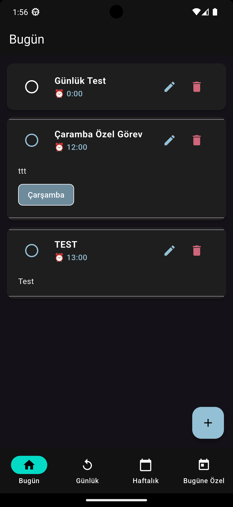

# Keyfimin Kahyası + AI

Bu projeyi keyfime göre 25 Yıl + AI + 30 dakikada geliştirdim.

## Özellikler

- **Farklı Todo Tipleri**:
  - **Günlük Görevler**: Her gün tekrarlanan rutin işler
  - **Haftalık Görevler**: Haftanın belirli günlerinde yapılması gereken işler
  - **Bugüne Özel Görevler**: Sadece bugün için geçerli olan geçici görevler

- **Bildirim Sistemi**: 
  - Görevler için zamanlanmış hatırlatmalar
  - Görev başlama saatinden 5 dakika önce otomatik bildirim

- **Kullanıcı Dostu Arayüz**:
  - Kolay görev ekleme ve düzenleme
  - Kategorilere göre ayrılmış görev listeleri
  - Material Design 3 ile modern ve koyu tema
  - Sezgisel gezinme ve akıcı animasyonlar

## Teknik Detaylar

- Flutter ile geliştirilmiş çapraz platform uygulama
- SQLite veritabanı ile yerel veri saklama
- Provider kullanılarak durum yönetimi
- Flutter Local Notifications ile bildirim sistemi
- CSV dışa/içe aktarma desteği
- Gerçek zamanlı veri senkronizasyonu

## Ekran Görüntüleri

## Gelecek Özellikler

- Bildirim Ayarları
- Bulut senkronizasyon
- İstatistikler ve raporlama
- Kategori filtreleme
- Widget desteği
- Tema özelleştirme